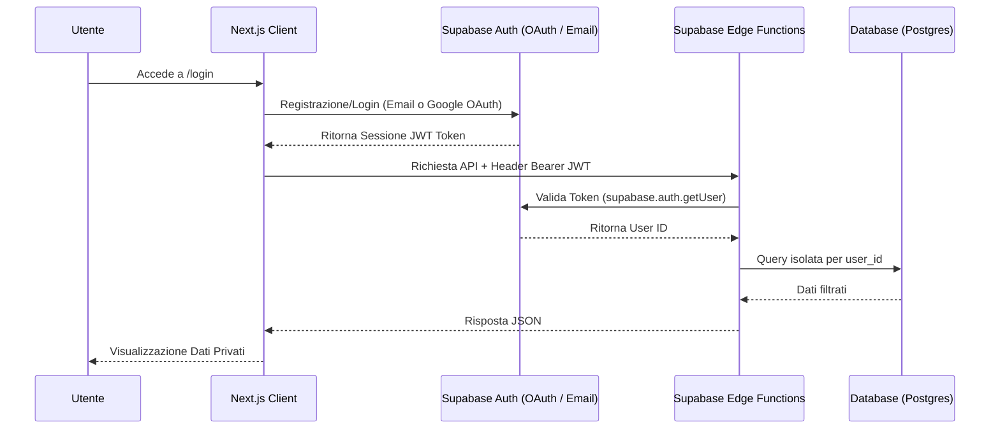

# Sistema di Autenticazione Utente (Email & OAuth 2.0)

Questo piano descrive i passaggi per integrare l'autenticazione degli utenti in BillSnap utilizzando **Supabase Auth** per la registrazione via email e l'accesso tramite **OAuth 2.0** (es: Google). Il sistema assicurerà che le ricevute e le statistiche siano isolate e visibili solo al rispettivo proprietario.

---

## Architettura e Flusso di Autenticazione



---

## Modifiche Proposte

### 1. Configurazione Supabase (Dashboard)
- **Email Auth**: Abilitare l'accesso con email/password. Disabilitare temporaneamente la conferma email per agevolare lo sviluppo locale/testing, se necessario.
- **Provider OAuth 2.0 (Google/GitHub)**:
  - Abilitare il provider Google in *Authentication > Providers*.
  - Configurare Client ID e Client Secret di Google.
  - Aggiungere il Redirect URL autorizzato in Google Cloud:
    `https://kkuitfbewuxrkysvvxyz.supabase.co/auth/v1/callback`

### 2. Frontend (Next.js Pages & Client-Side)

#### [NEW] [`app/login/page.tsx`](file:///c:/Users/matti/OneDrive/Desktop/Progetti/BillSnap/app/login/page.tsx)
- Pagina con form di login e registrazione per email/password.
- Pulsante per accesso rapido con OAuth 2.0 (Google).
- Gestione di messaggi di feedback di successo o errore tramite Toast.

#### [NEW] [`app/auth/callback/route.ts`](file:///c:/Users/matti/OneDrive/Desktop/Progetti/BillSnap/app/auth/callback/route.ts)
- Rotta server (Next.js Route Handler) per intercettare il codice di ritorno di Google OAuth, scambiarlo con una sessione di Supabase e impostare i cookie di sessione.
- Reindirizza l'utente a `/` una volta autenticato.

#### [NEW] [`middleware.ts`](file:///c:/Users/matti/OneDrive/Desktop/Progetti/BillSnap/middleware.ts) (nella root di Next.js)
- Middleware di sicurezza che intercetta tutte le pagine protette (es. `/admin`, `/history`, `/stats`, `/review`, `/`).
- Se l'utente non ha una sessione attiva o un token valido nei cookie, viene reindirizzato in automatico a `/login`.

#### [MODIFY] [`lib/api.ts`](file:///c:/Users/matti/OneDrive/Desktop/Progetti/BillSnap/lib/api.ts)
- Aggiornare il client di chiamata per estrarre in automatico il token dell'utente corrente (tramite `supabase.auth.getSession()`) e passarlo come header `Authorization: Bearer <JWT_TOKEN>` ad ogni chiamata alle Edge Functions.

---

### 3. Backend (Supabase Edge Functions & Database)

#### [MODIFY] Isolamento dei Dati per Utente nel DB
- Aggiungere una colonna `user_id` di tipo `uuid` che fa riferimento a `auth.users.id` nelle tabelle `receipts`, `receipt_groups` e `rate_limits`.
- Attivare le politiche RLS (Row Level Security) per limitare la visualizzazione/modifica solo al proprietario del record:
  ```sql
  ALTER TABLE receipts ENABLE ROW LEVEL SECURITY;
  CREATE POLICY "Gli utenti vedono solo i propri scontrini" ON receipts
    FOR ALL USING (auth.uid() = user_id);
  ```

#### [MODIFY] Verifica del JWT nelle Edge Functions ([`_shared/supabase.ts`](file:///c:/Users/matti/OneDrive/Desktop/Progetti/BillSnap/supabase/functions/_shared/supabase.ts))
La funzione `getAuthenticatedUser(req)` convaliderà l'header Authorization:
- Se il token è valido, ritorna l'utente autenticato.
- Nelle Edge Functions (es. `save-receipt`), se `user` è presente, le query SQL filtreranno per `user_id` o salveranno i record associandoli all'ID utente verificato dal token.

---

## Piano di Verifica

1. **Test Registrazione Email**:
   - Registrarsi come nuovo utente tramite form.
   - Verificare la corretta creazione dell'utente in Supabase Authentication.
2. **Test OAuth 2.0 (Google)**:
   - Cliccare su "Accedi con Google".
   - Verificare il redirect alla schermata di autorizzazione e il successivo rientro automatico in app como utente loggato.
3. **Test Sicurezza (Middleware)**:
   - Provare ad accedere a `/admin` o `/stats` da una scheda in incognito (non loggato).
   - Verificare che si venga bloccati e reindirizzati su `/login`.
4. **Test Isolamento Scontrini**:
   - Creare due account distinti.
   - Caricare uno scontrino con l'account A.
   - Accedere con l'account B e verificare che la cronologia risulti vuota (i dati di A sono inaccessibili a B).
